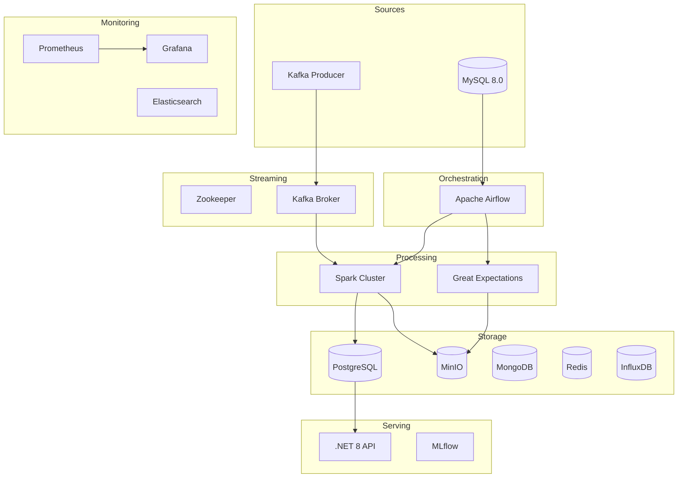

# End-to-End Data Pipeline Platform

<div align="center">

# 🚀 End-to-End Data Engineering Platform

### Production-Grade Modern Data Platform with Real-Time Streaming, ML Tracking, Data Warehousing & Cloud-Native Deployment

<p align="center">
  
  
  
  
</p>

<p align="center">
  <a href="YOUR_GITHUB_PROJECT_LINK/blob/main/LICENSE">
    
  </a>
</p>

</div>

---

## 👨‍💻 Author

### **Vikram Kumar**

- 🔗 GitHub: https://github.com/YOUR_GITHUB_USERNAME
- 💼 LinkedIn: https://linkedin.com/in/YOUR_LINKEDIN_USERNAME
- 📂 Project Repository: https://github.com/YOUR_GITHUB_USERNAME/YOUR_REPO_NAME

---

## 🛠️ Technology Stack

[](https://www.python.org/)
[](https://dotnet.microsoft.com/)
[](https://learn.microsoft.com/en-us/dotnet/csharp/)
[](https://developer.mozilla.org/en-US/docs/Web/HTML)
[](https://developer.mozilla.org/en-US/docs/Web/CSS)
[](https://developer.mozilla.org/en-US/docs/Web/JavaScript)
[](https://airflow.apache.org/)
[](https://spark.apache.org/)
[](https://kafka.apache.org/)
[](https://www.snowflake.com/)
[](https://www.postgresql.org/)
[](https://www.mysql.com/)
[](https://www.mongodb.com/)
[](https://redis.io/)
[](https://min.io/)
[](https://www.influxdata.com/)
[](https://www.elastic.co/)
[](https://mlflow.org/)
[](https://prometheus.io/)
[](https://grafana.com/)
[](https://swagger.io/)
[](https://serilog.net/)
[](https://github.com/DapperLib/Dapper)
[](https://www.docker.com/)
[](https://kubernetes.io/)
[](https://www.terraform.io/)
[](https://github.com/features/actions)
[](https://helm.sh/)
[](https://argoproj.github.io/cd/)

---

# 📌 Overview

A **production-ready, enterprise-scale, cloud-native data engineering platform** designed to handle:

- ⚡ Real-Time Data Streaming
- 📦 Batch ETL Pipelines
- 🧠 ML Experiment Tracking
- 📊 Data Warehousing
- 🔍 Observability & Monitoring
- ☁️ Kubernetes Deployments
- 🔄 CI/CD Automation
- 🏗️ Infrastructure as Code

This platform combines modern data engineering tools into a single fully-orchestrated ecosystem powered by:

- Apache Airflow
- Apache Spark
- Apache Kafka
- Snowflake
- PostgreSQL
- Docker & Kubernetes
- MLflow
- Grafana + Prometheus
- .NET 8 REST APIs

---

# 🏗️ Architecture



---

# ⚡ Core Features

## ✅ Batch Processing Pipeline

- MySQL extraction
- Automated Airflow DAG scheduling
- Great Expectations validation
- Spark ETL transformations
- PostgreSQL warehouse loading

---

## ✅ Real-Time Streaming

- Kafka producer/consumer architecture
- Spark Structured Streaming
- Real-time anomaly detection
- Stream persistence to PostgreSQL + MinIO

---

## ✅ Data Warehouse

- Star-schema warehouse architecture
- Fact & dimension tables
- Aggregation layers
- Snowflake integration
- PostgreSQL fallback support

---

## ✅ Cloud-Native Infrastructure

- Dockerized microservices
- Kubernetes deployment support
- Helm charts
- Terraform infrastructure automation
- AWS / Azure / GCP compatible

---

## ✅ Observability

- Prometheus metrics collection
- Grafana dashboards
- Elasticsearch logging
- Health monitoring endpoints
- Distributed logging support

---

## ✅ Machine Learning

- MLflow experiment tracking
- Model registry support
- Feature store stubs
- Pipeline experiment logging

---

# 🚀 Quick Start

## 1️⃣ Clone Repository

```bash
git clone https://github.com/YOUR_GITHUB_USERNAME/YOUR_REPO_NAME.git

cd YOUR_REPO_NAME
```

---

## 2️⃣ Configure Environment

```bash
cp .env.example .env
```

Update environment variables if needed.

---

## 3️⃣ Build Services

```bash
make build
```

---

## 4️⃣ Start Full Platform

```bash
make up
```

---

## 5️⃣ Verify Health

```bash
make health
```

---

## 6️⃣ Trigger Pipelines

```bash
make trigger-batch
make trigger-warehouse
```

---

# 🌐 Service URLs

| Service | URL |
|---|---|
| Airflow | http://localhost:8080 |
| Grafana | http://localhost:3000 |
| MLflow | http://localhost:5001 |
| Swagger API | http://localhost:5000/swagger |
| Spark Master | http://localhost:8081 |
| Prometheus | http://localhost:9090 |
| MinIO Console | http://localhost:9001 |

---

# 📦 Deployment Modes

| Deployment | Command |
|---|---|
| Local Full Stack | `make deploy-local` |
| Local Lite Stack | `make deploy-lite` |
| Kubernetes | `make deploy-k8s` |
| AWS EKS | `make deploy-aws` |
| GCP GKE | `make deploy-gcp` |
| Azure AKS | `make deploy-azure` |

---

# 🧪 Testing

Run all tests:

```bash
make test
```

Run linting:

```bash
make lint
```

Format codebase:

```bash
make format
```

---

# 📂 Project Structure

```bash
├── airflow/
├── spark/
├── kafka/
├── storage/
├── monitoring/
├── ml/
├── snowflake/
├── governance/
├── tests/
├── scripts/
├── terraform/
├── kubernetes/
├── helm/
├── sample_dotnet_backend/
├── docker-compose.yaml
├── Makefile
├── requirements.txt
└── index.html
```

---

# 🔥 CI/CD Pipeline

GitHub Actions automatically performs:

- Linting
- Unit Testing
- Docker Builds
- Integration Testing
- Compose Validation
- Deployment Verification

on every push & pull request.

---

# 📊 Monitoring Stack

| Tool | Purpose |
|---|---|
| Grafana | Dashboards |
| Prometheus | Metrics |
| Elasticsearch | Logging |
| Airflow | Pipeline Monitoring |
| MLflow | Experiment Tracking |

---

# ☁️ Infrastructure Support

This project supports:

- Docker Compose
- Kubernetes
- Helm
- Terraform
- AWS EKS
- Azure AKS
- Google GKE
- On-Prem Kubernetes

---

# 🔐 Environment Variables

```env
POSTGRES_USER=
POSTGRES_PASSWORD=
MYSQL_USER=
MYSQL_PASSWORD=
KAFKA_BROKER=
SPARK_MASTER_URL=
MINIO_ROOT_USER=
MINIO_ROOT_PASSWORD=
SNOWFLAKE_ACCOUNT=
SNOWFLAKE_USER=
SNOWFLAKE_PASSWORD=
```

---

# 🧠 Key Engineering Concepts Used

- Data Engineering
- ETL Pipelines
- Streaming Architecture
- Distributed Systems
- Event-Driven Processing
- Cloud-Native Infrastructure
- Infrastructure as Code
- Observability Engineering
- Microservices Architecture
- CI/CD Automation

---

# 📈 Scalability Highlights

✅ Horizontal scaling support  
✅ Containerized architecture  
✅ Kubernetes-native deployment  
✅ Cloud deployment ready  
✅ Infrastructure automation  
✅ Modular service design  
✅ Distributed processing pipelines  

---

# 🤝 Contributing

Contributions are welcome.

```bash
# Fork repository
# Create feature branch
git checkout -b feature/amazing-feature

# Commit changes
git commit -m "Added amazing feature"

# Push branch
git push origin feature/amazing-feature
```

Open a Pull Request 🚀

---

# 📜 License

This project is licensed under the MIT License.

---

# ⭐ Support

If you found this project useful:

- ⭐ Star the repository
- 🍴 Fork the project
- 🧠 Share with others

---

<div align="center">

## 💡 Built with Passion for Data Engineering & Cloud-Native Systems

### By Vikram Kumar

</div>
